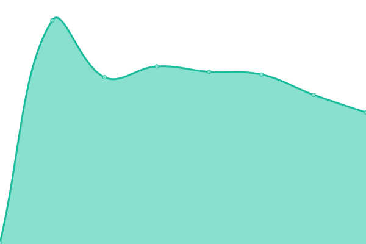

# [📈 Live Status](https://up.rhscz.eu): <!--live status--> **🟩 All systems operational**

This repository contains the open-source uptime monitor and status page for [Uptime Oz](https://up.rhscz.eu), powered by [Upptime](https://github.com/upptime/upptime).

With [Upptime](https://upptime.js.org), you can get your own unlimited and free uptime monitor and status page, powered entirely by a GitHub repository. We use [Issues](https://github.com/uptime/uptime/issues) as incident reports, [Actions](https://github.com/uptime/uptime/actions) as uptime monitors, and [Pages](https://up.rhscz.eu) for the status page.

<!--start: status pages-->
<!-- This summary is generated by Upptime (https://github.com/upptime/upptime) -->
<!-- Do not edit this manually, your changes will be overwritten -->
<!-- prettier-ignore -->
| URL | Status | History | Response Time | Uptime |
| --- | ------ | ------- | ------------- | ------ |
|  [rhscz.eu](https://rhscz.eu) | 🟩 Up | [rhscz-eu.yml](https://github.com/rhsCZ/uptime/commits/HEAD/history/rhscz-eu.yml) | 

 434ms
     
 | 

<a href="https://up.rhscz.eu/history/rhscz-eu">100.00%</a>
    

|  [search.rhscz.eu](https://search.rhscz.eu) | 🟩 Up | [search-rhscz-eu.yml](https://github.com/rhsCZ/uptime/commits/HEAD/history/search-rhscz-eu.yml) | 

 445ms
     
 | 

<a href="https://up.rhscz.eu/history/search-rhscz-eu">100.00%</a>
    

|  [rhsCZ vps1](vps.rhscz.eu) | 🟩 Up | [rhs-cz-vps1.yml](https://github.com/rhsCZ/uptime/commits/HEAD/history/rhs-cz-vps1.yml) | 

 133ms
     
 | 

<a href="https://up.rhscz.eu/history/rhs-cz-vps1">100.00%</a>
    

|  [rhsCZ vps2](vps2.rhscz.eu) | 🟩 Up | [rhs-cz-vps2.yml](https://github.com/rhsCZ/uptime/commits/HEAD/history/rhs-cz-vps2.yml) | 

 130ms
     
 | 

<a href="https://up.rhscz.eu/history/rhs-cz-vps2">100.00%</a>
    

|  [rhsCZ vps3](vps3.rhscz.eu) | 🟩 Up | [rhs-cz-vps3.yml](https://github.com/rhsCZ/uptime/commits/HEAD/history/rhs-cz-vps3.yml) | 

 136ms
     
 | 

<a href="https://up.rhscz.eu/history/rhs-cz-vps3">100.00%</a>
    

|  [rhsCZ vps4](vps4.rhscz.eu) | 🟩 Up | [rhs-cz-vps4.yml](https://github.com/rhsCZ/uptime/commits/HEAD/history/rhs-cz-vps4.yml) | 

 142ms
     
 | 

<a href="https://up.rhscz.eu/history/rhs-cz-vps4">98.76%</a>
    

<!--end: status pages-->

[**Visit our status website →**](https://up.rhscz.eu)

## 📄 License

- Powered by: [Upptime](https://github.com/upptime/upptime)
- Code: [MIT](./LICENSE) © [Uptime Oz](https://up.rhscz.eu)
- Data in the `./history` directory: [Open Database License](https://opendatacommons.org/licenses/odbl/1-0/)
